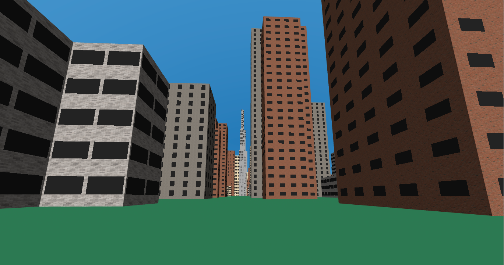

aframe-shader-buildings
===

An [A-Frame](https://aframe.io) [WebXR](https://webvr.info/) component for cheaply creating boxy buildings.
Allows you to place thousands of buildings in your scene!
Details are perfectly sharp, no matter how close you get.



[live example scene](https://dougreeder.github.io/aframe-shader-buildings/example.html)

Usage
---

Include using 
```html
<script src="https://unpkg.com/aframe-shader-buildings@^0.5.0/dist/main.js"></script>
```


Declaration of a single two-tiered building:
```html
<a-shader-buildings sun-position="-0.5 1.0 1.0" buildings=
		'[{"x":5,"z":-995,"xSections":12,"xWingSections":5,"zSections":12,"zWingSections":5,"ySections":30},{"x":0,"z":-1000,"y":120,"xSections":9,"xWingSections":4,"zSections":9,"zWingSections":4,"ySections":30}]'
></a-shader-buildings>
```
The `buildings` attribute is JSON, which is problematic in HTML attributes.  The recommended workaround is 
to use single quotes around the attribute value, which all modern browsers parse correctly 
(but an HTML linter will complain about).

Normally, the `buildings` attribute is set programatically.


Internals
---
The geometry of all buildings of a single entity is merged, so there's only one draw call.

Ell-shaped buildings use only 12 triangles per tier, regardless of the number of windows.


To Do
---
More building shapes: cee, eee and box, for starters.
