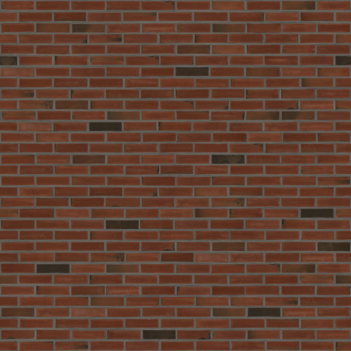

aframe-shader-buildings
===

An [A-Frame](https://aframe.io) [WebXR](https://webvr.info/) component for cheaply creating boxy buildings.
Allows you to place thousands of buildings in your scene, without using up your GPU budget!


[live example scene](https://dougreeder.github.io/aframe-shader-buildings/example.html)
On desktop, drag to turn and use WASD keys to move. 

[flyable city from Elfland Glider](https://dougreeder.github.io/elfland-glider/city/)

Usage
---

Include using 
```html
<script src="https://unpkg.com/aframe-shader-buildings@^1.1.0beta/dist/main.js"></script>
```


Declaration of a single two-tiered building:
```html
<a-assets>
    
</a-assets>
<a-shader-buildings sun-position="-0.5 1.0 1.0" wall-src="#brick" wall-color="#675342" buildings=
		'[{"x":5,"z":-995,"xCoreSections":7,"xWingSections":5,"zSections":12,"zWingSections":5,"ySections":30},{"x":0,"z":-1000,"y":120,"xCoreSections":5,"xWingSections":4,"zSections":9,"zWingSections":4,"ySections":30}]'
></a-shader-buildings>
```
The `buildings` attribute is JSON, which is problematic in HTML attributes.  
So normally, the `buildings` attribute is set programmatically (see example.html).
The recommended workaround for declaring in HTML is 
to use single quotes around the attribute value, which all modern browsers parse correctly 
(but an HTML linter will complain about).

All buildings in the same entity will have the same style, so typically you'll define a number of a-shader-buildings
entities, each with a different style.

Typically, you'll place the buildings on a flat plateau or valley floor, which may be at any elevation.
Placing a building on a slope requires careful planning to keep windows from being buried.


Parameters 
---
Typically, you'll set the positions of buildings in the `buildings` element, and leave the entity x, y, and z as zero, but you don't have to.

### elevation-geometry, elevation-material
default: 0

set these to the same value. Altitude of the base of the buildings.


### x-proportion-geometry, x-proportion-material
default: 5

set these to the same value - this is the length of a section of wall that contains one window along the x-axis in meters


### z-proportion-geometry, z-proportion-material
default: 5

set these to the same value - this is the length of a section of wall that contains one window along the z-axis in meters

### y-proportion-geometry, y-proportion-material
default: 4

set these to the same value - this is the height of a storey in meters

### window-width
default: 0.0 (half the section is window)
min: -1.0
max: 1.0

proportion of a section which is window

### window-height
default: -0.4
min: -1.0
max: 1.0

proportion of a storey which is window

### wall-src
default: none

a reference to a square image for the texture of the walls

### wall-zoom
default: 2.0
min: 0.001

the number of linear meters that one texture image will cover

### wall-color
default: '#909090'

the base color of walls, if `wall-src` is not set or hasn't loaded yet

### window-color
default: '#181818'

the base color of windows

### sun-position
default: {x:-1.0, y:1.0, z:-1.0}

The direction from which the sun is shining

### buildings
default: "[]" (no buildings)

JSON string of an array of objects, each object describing a building tier, containing some of the following properties.
A building consists of 1 or more tiers.  A tier contains 1 or more stories. 
Currently, all tiers are ell-shaped.

* x: location of tier, relative to group. Should be a multiple of the x-proportion
* z: location of tier, relative to group. Should be a multiple of the z-proportion
* y: location of tier, relative to group. Should be a multiple of the y-proportion
* xCoreSections: # sections (and thus, windows) in the tier core along the x axis. Add about 0.15 (depending on the windowWidth) to make a wall windowless.
* xWingSections: # sections (and thus, windows) in the wing along the x axis. Add about 0.15 (depending on the windowWidth) to make a wall windowless.
* zCoreSections: # sections (and thus, windows) in the tier core along the z axis. Add about 0.15 (depending on the windowWidth) to make a wall windowless.
* zWingSections: # sections (and thus, windows) in the wing along the z axis. Add about 0.15 (depending on the windowWidth) to make a wall windowless.
* ySections: # stories in the tier. Add up to about 0.4 to give a tier some attic space.


### rotation
Buildings should only be rotated in 90-degree increments.


Development
---
1. `npm install`

2. edit files

3. `npm run develop`

4. when ready to commit:
`npm run build`


Internals
---
The geometry of all buildings of a single entity is merged, so there's only one draw call.

Ell-shaped buildings use only 12 triangles per tier, regardless of the number of windows.


To Do
---

* Use a modified version of a Phong shader, for more realism
* rotate buildings for more variety
* More building shapes: tee, cee, plus, eee and box, for starters.
